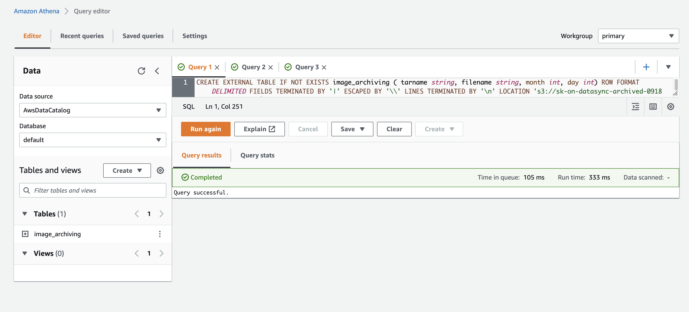
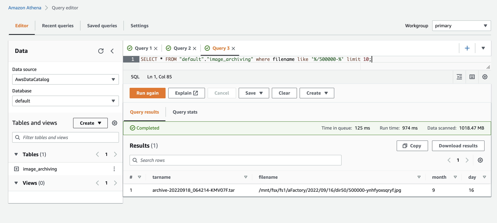

## Small Files Archiving Solution
This solution is consist of two scripts. The one is to combine many small files into big TARfile, and the other one is to search and retrieve specific file from TAR archived file.

This feature will help user reduce cloud storage cost reducing PUT request cost, and transfer to cloud faster than transferring original files.

### Features
- Generating tarfiles and uploading to S3 directly
- Generating tarfiles and saving to filesystem directory
- Providing manifest files which is including tarfile, subset file, date, file size, first block, last block
- Finding tarfiles which includes specific subset file by condition, such as filename, date, duration
- Retrieving subset file itself from a tarfile in S3 using [byte-range](https://docs.aws.amazon.com/whitepapers/latest/s3-optimizing-performance-best-practices/use-byte-range-fetches.html)
- Generating tarfiles from input file, instead of scanning filesystem(2024.02.25) 

## Pre-requsites
- python >= 3.7
- linux
- [aws cli](https://docs.aws.amazon.com/cli/latest/userguide/cli-configure-files.html)

I'll show you how to use this solution.

## Discovering source directory and file structure
In manufacture environment, product image files would be stored in local storage based on directory structure “Line/Equipment/Lot/Date”. Especially dividing files by date order is effective to search specific object with index.

* Directory Structure Example: /mnt/1Line/1E/1L/2022/08/01

## Combining small file into big file
User can combine files into big file with [s3archiver.py](https://github.com/aws-samples/small-files-archiving-solution/blob/main/s3archiver.py) script. It will scan the source directory and generate 10GB TAR file by default, or you can generate TAR files based on number of source files. Also it generate a manifest file per each TAR file, and  manifest file contains tarfile name, subset filename, date(YYYY|MM|DD), file size, start block, last block which can be used to download specific subset file only, not entire tarfile. Below is running script, and I will explain each parameter.

### Parameters os s3archiver.py
```bash
usage: s3archiver.py [-h] --src_dir SRC_DIR --protocol PROTOCOL
                     [--prefix_root PREFIX_ROOT] [--max_process MAX_PROCESS]
                     --combine COMBINE [--max_file_number MAX_FILE_NUMBER]
                     [--max_tarfile_size MAX_TARFILE_SIZE]
                     [--bucket_name BUCKET_NAME] [--endpoint ENDPOINT]
                     [--profile_name PROFILE_NAME]
                     [--storage_class STORAGE_CLASS]
                     [--tar_prefix TAR_PREFIX] [--fs_dir FS_DIR]

optional arguments:
  -h, --help            show this help message and exit
  --src_dir SRC_DIR     source directory e) /data/dir1/
  --input_file          instead of **--src_dir**, user can specify **--input_file** to ingest files
  --protocol PROTOCOL   specify the protocol to use, s3 or fs
  --prefix_root PREFIX_ROOT
                        prefix root e) dir1/
  --max_process MAX_PROCESS
                        NUM e) 5
  --combine COMBINE     size | count, if you combind files based on tarfile
                        size, select 'size', or if you combine files based on
                        file count, select 'count'
  --max_file_number MAX_FILE_NUMBER
                        max files in one tarfile
  --max_tarfile_size MAX_TARFILE_SIZE
                        NUM bytes e) $((1*(1024**3))) # == (1*(1024*1024*1024)bytes == 1GB.
  --bucket_name BUCKET_NAME
                        your bucket name e) your-bucket
  --endpoint ENDPOINT   snowball endpoint e) http://10.10.10.10:8080 or
                        https://s3.ap-northeast-2.amazonaws.com
  --profile_name PROFILE_NAME
                        aws_profile_name e) sbe1
  --storage_class STORAGE_CLASS
                        specify S3 classes, be cautious Snowball support only
                        STANDARD class; StorageClass=STANDARD|REDUCED_REDUNDAN
                        CY|STANDARD_IA|ONEZONE_IA|INTELLIGENT_TIERING|GLACIER|
                        DEEP_ARCHIVE|OUTPOSTS|GLACIER_IR
  --tar_prefix BUCKET_PREFIX
                        prefix of tar files in the bucket
  --manifest_prefix BUCKET_PREFIX
                        prefix of menifest files in the bucket
  --fs_dir FS_DIR       specify fs mounting point when protocol is fs
```

### Generating tarfiles and uploading to S3 directly
You can run [s3archiver.py](https://github.com/aws-samples/small-files-archiving-solution/blob/main/s3archiver.py) to upload tarfiles into S3 directly. In this case, you can specify specify prefix optionally.
```bash
## without prefix
python3 s3archiver.py --protocol s3 --src_dir '/data/nfsshare/fs1' --combine size --max_tarfile_size $((1*(1024**3))) --max_process 10 --bucket_name 'your-own-dest-repo'
```

```bash
## with prefix
python3 s3archiver.py --protocol s3 --src_dir '/data/nfsshare/fs1' --combine size --max_tarfile_size $((500*(1024**2))) --max_process 10 --bucket_name 'your-own-dest-repo' --tar_prefix 'day1' --manifest_prefix 'day1'
```

- --protocol s3: sending tarfile into S3 directly
- --src_dir: specify source directory of filesystem to be archived
- --combind count|size: Tarfile can be created by file size or number of files. if you specify **--combine size** and **--max_tarfile_size $((10*(1024**3)))***, this program will create 10GB TARfile each. if you specify **--combind count** and **--max_file_number 500**, TARfile will contain 500 original files.
- --max_process: number of concurrent job. default is 10. It means 10 process will create TAR files in parallel
- --max_tarfile_size: It means tarfile size. $((10*1024**3)) means 10*(1024*1024*1024)=10GB
- --bucket_name: s3 bucket name

### Using **--input_file** instead of **--src_dir**
If **--inpu_file** parameter is used, this program will generate tarfiles with files on input_file instead of scanning filesystem. This feature will be useful for treating error files.
#### example of input_file format
```bash
find /data -type f > input.txt

cat input.txt
/data/dir0/file1.txt
/data/dir0/file2.txt
/data/dir0/file3.txt
/data/dir0/file4.txt
/data/dir0/file5.txt
```

### Generating tarfiles and saving to filesystem directory
You can run [s3archiver.py](https://github.com/aws-samples/small-files-archiving-solution/blob/main/s3archiver.py) to save tarfiles in filesystem. In this case, you have to specify --fs_dir to indicate destination directory of filesystem.
```bash
python3 s3archiver.py --protocol fs --src_dir '/data/nfsshare/fs1' --combine size --max_tarfile_size $((1*(1024**3))) --max_process 10 --fs_dir '/data2/dest'
```
- --protocol fs: saving tarfile in filesystem
- --fs_dir: specify destination directory to store TAR files.

#### Running archiving script
```bash
[ec2-user@ip-172-31-42-60 ~]$ python3 s3archiver.py --protocol s3 --src_dir '/data/nfsshare/fs1' --combine size --max_tarfile_size $((1*(1024**3))) --max_process 10 --bucket_name 'your-own-dest-repo'
starting script...2023-02-14 06:00:55.726736
/src/dataset/fs1 directory is archived
archive-20230214_060055-V7N3GE.tar is combining based on count
archive-20230214_060055-PJO3S1.tar is combining based on count
archive-20230214_060055-YLVSEY.tar is combining based on count
archive-20230214_060055-Z08HBY.tar is combining based on count
archive-20230214_060055-4U86Q3.tar is combining based on count
archive-20230214_060055-MJ0OVE.tar is combining based on count
archive-20230214_060055-GBE44W.tar is combining based on count
archive-20230214_060055-WTA0PS.tar is combining based on count
archive-20230214_060055-MMRGE4.tar is combining based on count
archive-20230214_060055-LHWY1P.tar is combining based on count
archive-20230214_060055-YLVSEY.tar is archived successfully
archive-20230214_060055-8V0VSU.tar is combining based on count
archive-20230214_060055-Z08HBY.tar is archived successfully
archive-20230214_060055-LUL0IK.tar is combining based on count
archive-20230214_060055-4U86Q3.tar is archived successfully
...
...
...
```

##### Result of script
```bash
archive-20230214_055044-VOXBIY.tar is archived successfully

archive-20230214_055044-T6O20X.tar is archived successfully

archive-20230214_055044-E6KD87.tar is archived successfully

archive-20230214_055044-MR3ZC8.tar is archived successfully

/src/dataset/fs1 directory is archived
====================================
Combine: count
size or count: 500
Duration: 0:00:10.501529
Scanned file numbers: 503006
TAR files location: /dest/2023/2/14
END
====================================
```
success.log and error.log will be stored in **logs** directory below command running directory.

### Providing manifest files 
When uploading to S3 is finished, you can find manifest files in **lists** directory under **logs** directory and under **tar_prefix**, and **manifest_prefix**.
When saving to filesystem, newly generated tarfiles and manifest files will be stored in path which provided by **--fs_dir** argument. There would be **lists** directory in destination location. In there, manifest files are stored. Each TARfile will have its own manifest files. 

```bash
[ec2-user@ip-172-31-45-24 small-files-archiving-solution]$ ls logs/lists
archive_20230501_110237_36WP7R.tar-contents.csv  archive_20230501_110237_JO90Y7.tar-contents.csv
archive_20230501_110237_3JML96.tar-contents.csv  archive_20230501_110237_NY8J0W.tar-contents.csv
archive_20230501_110237_CKEF2M.tar-contents.csv  archive_20230501_110237_RB5MMU.tar-contents.csv
archive_20230501_110237_GQYIVS.tar-contents.csv  archive_20230501_110237_SJH2P8.tar-contents.csv
archive_20230501_110237_HOXYFB.tar-contents.csv  archive_20230501_110237_V3DO1P.tar-contents.csv
```

This manifest file contains subset files information of one tarfile. Its information is including tarfile, subset file, date(year|month|day), file size(byte), start block, last block.

- example of manifest file
```bash
[ec2-user@ip-172-31-45-24 lists]$ head -n 10 archive_20230501_110237_36WP7R.tar-contents.csv
archive_20230501_110237_36WP7R.tar|/data/nfsshare/fs1/d0042/dir0003/file0307|2023|5|1|21772|0|22527
archive_20230501_110237_36WP7R.tar|/data/nfsshare/fs1/d0042/dir0003/file0306|2023|5|1|24485|22528|47615
archive_20230501_110237_36WP7R.tar|/data/nfsshare/fs1/d0042/dir0003/file0305|2023|5|1|9846|47616|58367
archive_20230501_110237_36WP7R.tar|/data/nfsshare/fs1/d0042/dir0003/file0304|2023|5|1|33002|58368|92159
archive_20230501_110237_36WP7R.tar|/data/nfsshare/fs1/d0042/dir0003/file0303|2023|5|1|18425|92160|111103
archive_20230501_110237_36WP7R.tar|/data/nfsshare/fs1/d0042/dir0003/file0302|2023|5|1|30775|111104|142847
archive_20230501_110237_36WP7R.tar|/data/nfsshare/fs1/d0042/dir0003/file0301|2023|5|1|20421|142848|163839
archive_20230501_110237_36WP7R.tar|/data/nfsshare/fs1/d0042/dir0003/file0300|2023|5|1|34504|163840|199167
archive_20230501_110237_36WP7R.tar|/data/nfsshare/fs1/d0042/dir0003/file0299|2023|5|1|31042|199168|230911
archive_20230501_110237_36WP7R.tar|/data/nfsshare/fs1/d0042/dir0003/file0298|2023|5|1|19912|230912|251391
```
start block and last block will be used to download subset file itself from S3 directly.

## Transferring tarfiles into S3
You can select 3 options.
1. using s3archiver.py with --protocol s3 option
2. using AWS DataSync
3. using StorageGateway while mounting --fs_dir directory via nfs 

Another way to transfer data into S3 is to use [mountpoint-s3](https://github.com/awslabs/mountpoint-s3). Using with "--protocol fs" parameter, user can mount S3 in posix style and archive data in S3 easily.

``` bash
$ mount-s3 --prefix mount/ your-own-dest-repo /mnt/s3
```

## Finding tarfiles in Amazon S3
Sometimes, we have to download some files from Amazon S3 to validate the product status. In this case, first we have to find tarfile which having specific subset files. Using AWS Athena we can find tarfile by condition, such as filename, date, duration using manifest file.

### Creating external table on AWS Athena with manifest files
In order to search an object in manifest file, the first job is to create an external table with Athena query. It will create table schema based on contents of manifest files. Below is the sample query to create external table.

```bash
 CREATE EXTERNAL TABLE IF NOT EXISTS image_archiving ( tarname string, filename string, year int, month int, day int, size int, start_byte int, stop_byte int, md5 string) ROW FORMAT DELIMITED FIELDS TERMINATED BY '|' ESCAPED BY '\\' LINES TERMINATED BY '\n' LOCATION 's3://your-own-dest-repo/lists/'
```



Next step is to execute query to find out the TAR file which contains specific object.

- Query based on File name
```
select * from image_archiving where filename like '%/500000-%' limit 10;
```

- Select Query based on Date
```
select * from image_archiving where month=09 and day=16 limit 10;
```

- Select Query based on Duration
```
select * from image_archiving where month=09 and (day >= 16 and day <= 18) limit 10;

```




## Retrieving subset file itself from a tarfile in S3 using [byte-range](https://docs.aws.amazon.com/whitepapers/latest/s3-optimizing-performance-best-practices/use-byte-range-fetches.html)
After finding out the TAR file which containing specific object, user can retrieve that TAR file using AWS CLI or AWS management console, and then, user should extract TAR file to get target file.


However, if we need only a few of files, downloading entire 10GB tarfile is not efficient. In this case, we can use byte-range feature of Amazon S3. for your convinience, I made simple script for it, [get_tar_part.py](https://github.com/aws-samples/small-files-archiving-solution/blob/main/get_bytes_range/get_tar_part.py).

### Running get_tar_part.py
This [get_tar_part.py](https://github.com/aws-samples/small-files-archiving-solution/blob/main/get_bytes_range/get_tar_part.py) script will download the subset file and extract it in current directory. As well, you can specify sequencial blocks of multiple files.
```
python3 get_tar_part.py --bucket_name 'your-own-dest-repo' --key_name 'archive_20230501_110237_36WP7R.tar' --start_byte '2056192' --stop_byte '2113534'
```
- --bucket_name: bucket name which is storing tarfile
- --key_name: tarfile name which found from previous Athena query
- --start_byte: subset file's start block written on manifest file
- --stop_byte: subset file's las block written on manifest file

#### Result of script
When script is finished, we can see extracted file names.
```bash
[ec2-user@ip-172-31-45-24 get_bytes_range]$ sh run_get_tar_part.sh
['data/nfsshare/fs1/d0042/dir0003/file0216', 'data/nfsshare/fs1/d0042/dir0003/file0215', 'data/nfsshare/fs1/d0042/dir0003/file0214', 'data/nfsshare/fs1/d0042/dir0003/file0213']
```

Here is the example of extracted files.
```bash
[ec2-user@ip-172-31-45-24 get_bytes_range]$ ls -l data/nfsshare/fs1/d0042/dir0003/
total 60
-rw-rw-r-- 1 ec2-user ec2-user  7697 Dec 20  2019 file0213
-rw-rw-r-- 1 ec2-user ec2-user 13637 Dec 20  2019 file0214
-rw-rw-r-- 1 ec2-user ec2-user 26441 Dec 20  2019 file0215
-rw-rw-r-- 1 ec2-user ec2-user  6346 Dec 20  2019 file0216
```

If specified block is not proper, it will create temp_tarfile to help to restore parts of files.

As an example, I modified --stop_byte to 2113534 intentionlly even though proper stop_byte is 2113535.

cat run_get_tar_part.sh
```
python3 get_tar_part.py --bucket_name 'your-own-dest-repo' --key_name 'archive_20230501_110237_36WP7R.tar' --start_byte '2056192' --stop_byte '2113534'
```

You can see warning message and incompleted tarfile.
```bash
[ec2-user@ip-172-31-45-24 get_bytes_range]$ sh run_get_tar_part.sh
unexpected end of data
Warning:
           Incompleted tar block is detected,
           but temp_tarfile is generated,
           you could recover some of files from temp_tarfile
temp tarfile: temp_tarfile-OTLEKX.tar
```

With _temp_tarfile-OTLEKX.tar_ file, you could save some files.
```bash
[ec2-user@ip-172-31-45-24 get_bytes_range]$ tar tvf  temp_tarfile-OTLEKX.tar
-rw-rw-r-- ec2-user/ec2-user 6346 2019-12-20 06:23 data/nfsshare/fs1/d0042/dir0003/file0216
-rw-rw-r-- ec2-user/ec2-user 26441 2019-12-20 06:23 data/nfsshare/fs1/d0042/dir0003/file0215
-rw-rw-r-- ec2-user/ec2-user 13637 2019-12-20 06:23 data/nfsshare/fs1/d0042/dir0003/file0214
-rw-rw-r-- ec2-user/ec2-user  7697 2019-12-20 06:23 data/nfsshare/fs1/d0042/dir0003/file0213
tar: Unexpected EOF in archive
tar: Error is not recoverable: exiting now
```

## Conclusion
Small file archiving solution is built to provide efficient way of archiving small file on Amazon S3. Combing small files into big TAR file can help customer reduce PUT request cost and monitoring cost, and storing data in Amazon S3 Intelligent Tiering help customer save storage cost specially for long-term archiving data. With Amazon Athena, customer can search specific file when he needs to retrieve it.

## Security
See [CONTRIBUTING](CONTRIBUTING.md#security-issue-notifications) for more information.
## License
This library is licensed under the MIT-0 License. See the LICENSE file.
